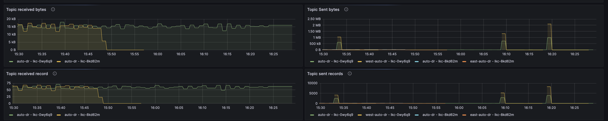
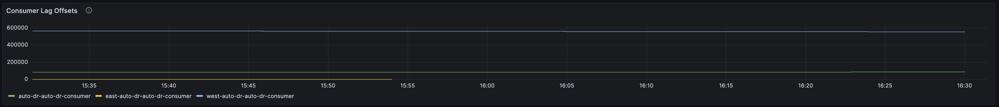
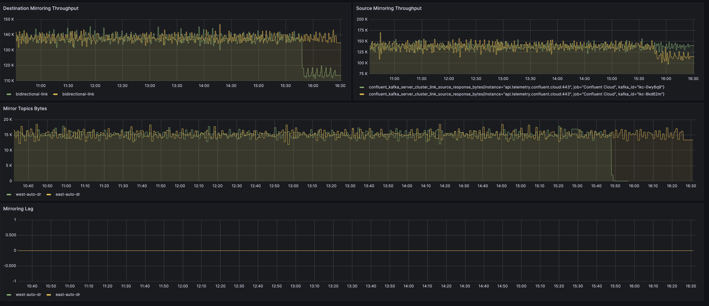

## Runbook - Testing automation of Kafka Client on Kubernetes (EKS) for Confluent Cloud HA Setup

### Verify the Steady State
```bash
# check the pods in kafka namespace
kubectl get pods -n kafka

# check the replicas of primary producer and consumer - should be 3 & 1
kubectl get deployments -n kafka primary-producer
kubectl get deployments -n kafka primary-consumer

# check the replicas of secondary producer and consumer - both be 0 
kubectl get deployments -n kafka secondary-producer
kubectl get deployments -n kafka secondary-consumer

# check the grafana dashboard - metrics: 
kubectl port-forward services/grafana 3000:80 -n monitoring

# 1. CC Dashboard - Consumer lag offset for each consumer group 
# 2. Cluster Link Dashboard - mirror lag offset for each mirror topic
```

#### Steady Cluster metrics:


#### Steady Consumer Lag metrics: 


#### Steady Cluster link metrics


### Initialize network disconnect into primary spoke network
```bash
# destroy transit gateway attachment on primary cluster
terraform destroy -target confluent_transit_gateway_attachment.primary

# check the logs for primary clients
kubectl logs -f <primary-producer-pod> -n monitoring
kubectl logs -f <primary-consumer-pod> -n monitoring
```

#### check the mirroring status on confluent cloud clusterlink UI
```bash
# https://confluent.cloud/cluster-links/<cluster_id>___<clusterlink_name>/overview
```
#### check the mirroring lag on grafana
```bash
# http://localhost:3000/d/kafka-cluster-dashboard/kafka-cluster-dashboard?orgId=1
```

#### check the consumer group lag for primary consumer
```bash
# http://localhost:3000/d/fhX5408Zk/confluent-cloud?orgId=1
# This is your RPO
```

### Manual Steps for cluster failover

#### Step 1:  Run producer & consumer for healthcheck topic on primary
```bash
export PATH="$PATH:./healthcheck/kafka_2.13-3.7.0/bin"

kafka-console-producer.sh --bootstrap-server <Primary-Bootstrap-Endpoint> --topic healthcheck --producer.config properties/producer-primary.properties

kafka-console-consumer.sh --bootstrap-server <Primary-Bootstrap-Endpoint> --topic healthcheck --from-beginning --max-messages 1 --consumer.config properties/consumer-primary.properties
```

#### Step 2:  If above step fails, run producer & consumer for healthcheck topic on secondary
```bash
kafka-console-producer.sh --bootstrap-server <Secondary-Bootstrap-Endpoint> --topic healthcheck --producer.config properties/producer-secondary.properties

kafka-console-consumer.sh --bootstrap-server <Secondary-Bootstrap-Endpoint> --topic healthcheck --from-beginning --max-messages 1 --consumer.config properties/consumer-secondary.properties
```

#### Step 3: If above step pass, run the deployment pipeline to update secondary replicas

```bash
kubectl scale deployment -n kafka secondary-producer --replicas=1 

kubectl scale deployment -n kafka secondary-consumer --replicas=3

# IMPORTANT: If you want the failed primary producer to send the data when primary comes back online, then DON'T scaledown the primary-producer. This would make sure ATLEAT ONCE consistency semantics. If you want ATMOST ONCE consistency, then scaledown the primary producer.

kubectl kubectl scale deployment -n kafka primary-producer --replicas=0

kubectl kubectl scale deployment -n kafka primary-consumer --replicas=0

# Check the topics production & consumption on confluent cloud UI

# https://confluent.cloud/environments/<cc-environment-id>/clusters/<secondary-cluster-id>/topics/auto-dr/overview
```

### Manual Steps for cluster failback

#### Step 1: Bring the primary cluster and clusterlink back online

```bash
# Activate the transit gateway attachment 
terraform apply -target confluent_transit_gateway_attachment.primary

# Check if the clusterlink is active
# https://confluent.cloud/cluster-links/<primary-cluster-id>___<clusterlink-name>/overview

# Check if the mirroring from secondary to primary is active 
# https://confluent.cloud/environments/<cc-environment-id>/clusters/<primary-cluster-id>/topics/west-auto-dr/overview
```

#### Step 2:  Run producer & consumer for healthcheck topic on primary
```bash

kafka-console-producer.sh --bootstrap-server <Primary-Bootstrap-Endpoint> --topic healthcheck --producer.config properties/producer-primary.properties

kafka-console-consumer.sh --bootstrap-server <Primary-Bootstrap-Endpoint> --topic healthcheck --from-beginning --max-messages 1 --consumer.config properties/consumer-primary.properties
```

#### Step 2: Check the write throughput on secondary topic 
```bash
# Destination mirroring throughput for both cluster must be equal
# http://localhost:3000/d/kafka-cluster-dashboard/kafka-cluster-dashboard?orgId=1

# Secondary cluster topic write throughput
# http://localhost:3000/d/fhX5408Zk/confluent-cloud?orgId=1
```
#### Step 3: Bring the primary producer online and secondary producer down
```bash
# IMPORTANT: If you had already scaledown primary producer previously to maintain ATMOST ONCE  consistency, then scaleup the producer. If you haven't scaledown it previously you would already have a running primary-producer that means you want ATLEAST ONCE consistency. However, in both cases secondary-producer has to be scaledown. 

kubectl scale deployment -n kafka primary-producer --replicas=1

kubectl scale deployment -n kafka secondary-producer --replicas=0
```

#### Step 4: Check the consumer lag, mirroring lag and mirroring throughput
```bash 
# Consumer lag must be 0 for secondary consumer
# http://localhost:3000/d/fhX5408Zk/confluent-cloud?orgId=1

# Cluster link mirroring lag must be 0 
# http://localhost:3000/d/kafka-cluster-dashboard/kafka-cluster-dashboard?orgId=1

# Destination mirroring throughput for both cluster must be equal
# http://localhost:3000/d/kafka-cluster-dashboard/kafka-cluster-dashboard?orgId=1
```

#### Step 5: Scaledown the secondary consumer group and scaleup the primary consumer group

```bash
kubectl scale deployment -n kafka secondary-consumer --replicas=0

kubectl scale deployment -n kafka primary-consumer --replicas=0
```

### Verify the steady state metrics
