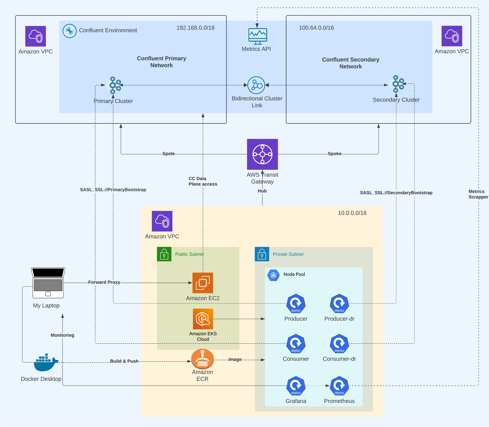
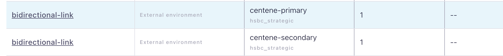
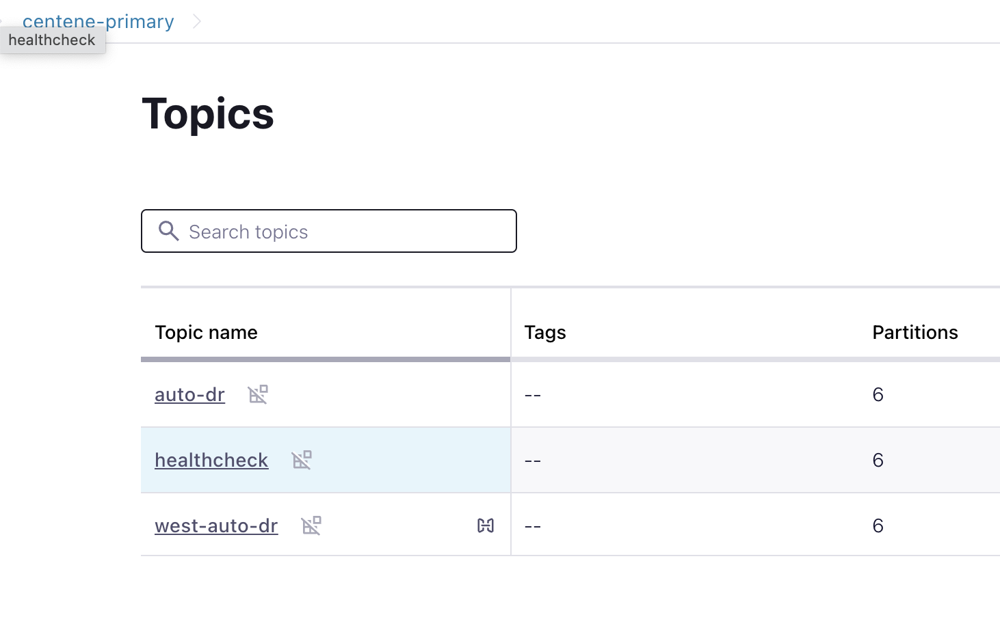
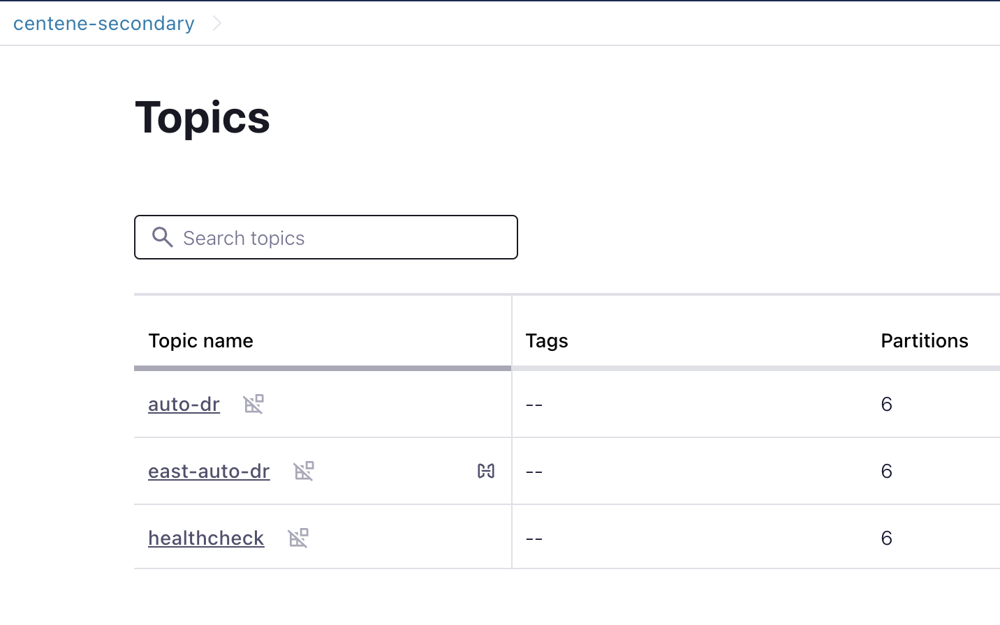
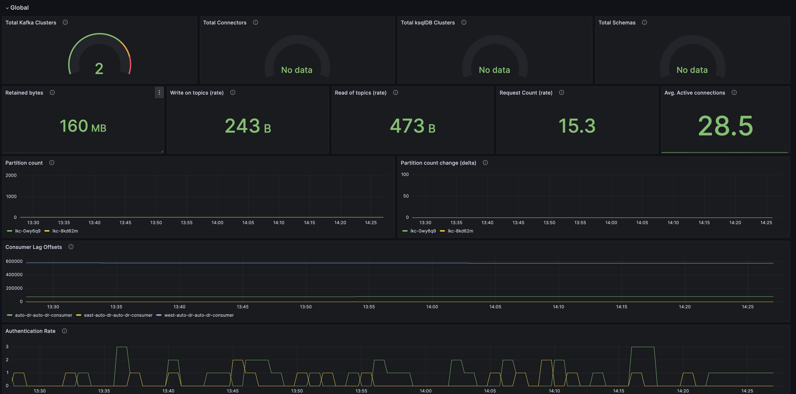
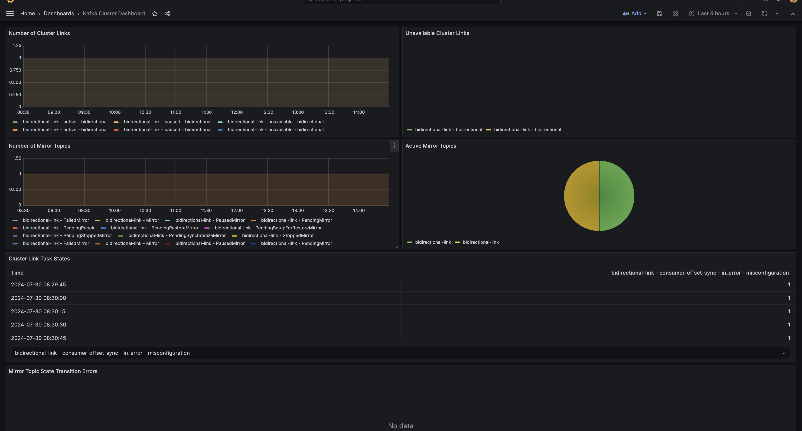

## Setup - Testing automation of Kafka Client on Kubernetes (EKS) for Confluent Cloud HA Setup

<p>This project consists of necessary configs needed to setup the required resources to test the automation of kafka clients failover and failback on kubernetes (EKS) for a high availability setup, connected over kafka primary and secondary clusters. </p>

### 

#### Components

```bash
1. Confluent Cloud Dedicated Cluster - Primary
2. Confluent Cloud Dedicated Cluster - Secondary
3. Confluent Primary Network - 192.168.0.0/16
4. Confluent Secondary Network - 100.64.0.0/16
5. Confluent Cloud Bidirectional Active-Active Cluster Link
5. AWS Hub Network - 10.0.0.0/16
6. AWS Transit Gateway
6. EKS Cluster with Nodepools on EC2
7. EC2 Bastion with Nginx forward proxy 
8. Kubernetes Workloads 
    a. Producer - Primary
    b. Producer - Secondary
    c. Consumer - Primary
    d. Consumer - Secondary 
    e. Grafana - CC Dashboards
    f. Prometheus - Scrapper pointing to Confluent Cloud Metrics API
9. AWS ECR - Docker image of Kafka Clients
10. Local Machine - MacOS with configure Proxy host and Docker desktop

```

### Requirements

```bash
1. MacOS with ARM Chip
2. Docker Desktop 
3. terraform >= v1.9.3
4. kubectl >= v1.26.2
5. docker >= v20.10.23
6. >=Java11 
6. nc (netcat) or telnet
7. nslookup
8. Stable public egress to AWS EC2 and EKS API Server
```

### Setup 

#### Initialization 

```bash
# Copy the file terraform.tfvars.sample into a new file terraform.tfvars

# Add the required variables in this file - 

# terraform.tfvars
cc_cloud_api_key=
cc_cloud_api_secret=
cc_env=
aws_key=
aws_secret=
aws_region=

# Run the init command - 
terraform init
```

#### Step 0: Confluent Side Init
```bash
# run the scafolding for required Confluent components

# Setup the service account, confluent network - primary and secondary, confluent clusters - primary & secondary and cluster role bindings

terraform apply -target confluent_service_account.default -target confluent_network.primay-network-transit-gateway -target confluent_network.secondary-network-transit-gateway -target confluent_kafka_cluster.primary -target confluent_kafka_cluster.secondary

terraform apply -target confluent_role_binding.cluster-admin-primary -target confluent_role_binding.cluster-admin-secondary -target confluent_role_binding.topic-write-primary -target confluent_role_binding.topic-write-secondary -target confluent_role_binding.topic-read-primary -target confluent_role_binding.topic-read-secondary
```

#### Step 1: AWS & Confluent Cloud Connection
```bash
# run the scafolding for required AWS components

# Setup the hub vpc and transit gateway
terraform apply -target module.vpc -target module.tgw

# Setup the Transit Gateway attachment on confluent side and route information on AWS side
terraform apply -target confluent_transit_gateway_attachment.primary -target confluent_transit_gateway_attachment.secondary -target aws_route.cc_primary_network -target aws_route.cc_secondary_network

# Setup the ssh key required to access the bastion host and the necessary security group rules.

terraform apply -target tls_private_key.bastion -target aws_key_pair.bastion -target local_file.private_key_pem_bastion -target local_file.public_key_bastion -target aws_security_group_rule.https -target aws_security_group_rule.kafka -target aws_security_group_rule.ssh -target aws_security_group_rule.allow_all

# Setup the bastion host with Nginx forward proxy on ec2 with other necessary configurations required
terraform apply -target module.ec2_instance 

# Install the nginx and configure forward proxy

ssh -i secrets/centene-bastion_public_key.pub ubuntu@<Bastion_Host_Public_Endpoint>

sudo apt-get install nginx

# Add the script given in configs/nginx.proxy.conf

sudo nano /etc/nginx/nginx.conf

### configs/nginx.proxy.conf - Add this to the /etc/nginx/nginx.conf above the http {} directive

stream {
    map $ssl_preread_server_name $targetBackend {
        default $ssl_preread_server_name;
    }

server {
   listen 9092;

   proxy_connect_timeout 1s;
   proxy_timeout 7200s;

...
...
...

# Restart Nginx and update the hosts locally 

sudo systemctl restart nginx
sudo systemctl status nginx # This should return "Active" status

exit

# On the local system, run this: 

sudo nano /etc/hosts

# Add this to the end of the file:

<Bastion Host Public IP> <Confluent Cloud Primary Bootstrap Host>

<Bastion Host Public IP> <Confluent Cloud Secondary Bootstrap Host>

# Eg:
# 34.80.109.110 pkc-xxxxxx.us-east-2.aws.confluent.cloud -> Primary
# 34.80.109.110 pkc-yyyyyy.us-east-2.aws.confluent.cloud -> Secondary

# Test the tcp connection with netcat or telnet
nc -vz <Confluent Cloud Primary Bootstrap Host> 9092
nc -vz <Confluent Cloud Secondary Bootstrap Host> 9092 

# Should see an output like this:
# Connection to pkc-xxxxxx.us-east-2.aws.confluent.cloud port 9092 [tcp/XmlIpcRegSvc] succeeded!
```

#### Step 2: Confluent Cloud - API Keys, Topics, Clusterlink and Mirror topics

```bash
# Create the confluent api keys and topics

terraform apply -target confluent_api_key.cluster-api-key-primary -target confluent_api_key.cluster-api-key-secondary -target confluent_kafka_topic.primary -target confluent_kafka_topic.primary-healthcheck -target confluent_kafka_topic.secondary -target confluent_kafka_topic.secondary-healthcheck 

# Create the Cluster link and mirror topics
terraform apply -target confluent_cluster_link.east-to-west -target confluent_cluster_link.west-to-east -target confluent_kafka_mirror_topic.from-east -target confluent_kafka_mirror_topic.from-west

### PS: We have prefixed the mirror topics with west in primary and east in secondary, however both clusters are in the same regions, its just incidental and symbolic. 
```
##### Available Cluster Links -
##### 

##### Primary Topics - 
##### 

##### Secondary Topics - 
##### 

####
#### Step 3: Kubernetes Setup - EKS Setup, Docker Images and Kubernetes Workloads - Monitoring & Client

```bash
# Setup the requirement for the kubernetes cluster by running - 
terraform apply -target aws_iam_role.node -target aws_iam_role_policy_attachment.AmazonEKSWorkerNodePolicy -target aws_iam_role_policy_attachment.AmazonEKS_CNI_Policy -target aws_iam_role_policy_attachment.AmazonEC2ContainerRegistryReadOnly -target aws_iam_policy.worker_policy -target aws_iam_role_policy_attachment.ALBIngressEKSPolicyCustom -target aws_kms_key.eks

# Setup the control plane -
terraform apply -target module.eks -target aws_eks_addon.vpc-cni -target kube-proxy

# Define Auth Config map and EBS SC - 
terraform apply -target kubectl_manifest.aws-auth -target kubectl_manifest.aws-ebs

# Setup the node pools - 
terraform apply -target aws_eks_node_group.default-node-pool -target aws_eks_node_group.arm-default-node-pool -target aws_eks_addon.csi-driver -target aws_eks_addon.coredns

# Setup the public ECR, build and push the client image -
terraform apply -target module.ecr -target random_id.auto-dr-client -target docker_image.auto-dr-client -target docker_registry_image.auto-dr-client

# Setup the kubernetes workloads -
terraform apply -target kubernetes_namespace.kafka -target kubernetes_config_map.kafka-primary -target kubernetes_config_map.kafka-secondary -target kubernetes_deployment.secondary_consumer -target kubernetes_deployment.primary_consumer -target kubernetes_deployment.secondary_producer -target kubernetes_deployment.primary_producer

# Get the client properties files - 
terraform apply -target local_file.consumer-primary -target local_file.consumer-secondary -target local_file.producer-primary -target local_file.producer-secondary

# Setup the monitoring - 
terraform apply -target kubernetes_namespace.monitoring -target helm_release.prometheus -target helm_release.grafana
```

##### Add the confluent cloud dashboard to grafana 
```bash
kubectl port-forward -n monitoring services/grafana 3000:3000
```
<p>Navigate to dependencies/grafana/dashboards and add ccloud.json and clusterlink.json to grafana dashboard</p>

##### Confluent Cloud Dashboard - 
##### 

##### Confluent Cloud Cluster Link Dashboard - 
##### 

#### Step 4: Runbook
##### [Runbook for DR Play](RUNBOOK.md)


